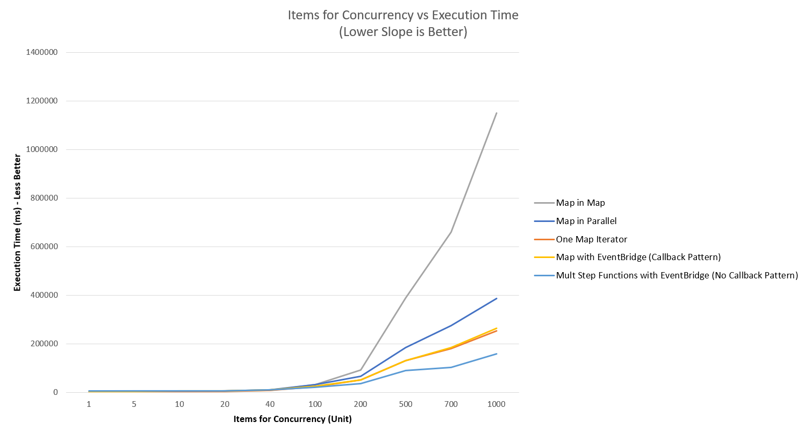

# High Concurrency Computing Using Amazon EventBridge with AWS Step Functions APG Pattern Example

[[_TOC_]]

## Important Note
THIS PERFORMANCE NUMBER IS NOT AIMING TO SHARE WITH CUSTOMER NOR REPRESENT FORMAL AWS PERFORMANCE INDICATOR, BUT RATHER EXPERIMENTS WITH DIFFERENT APPROACH FOR CERTAIN CUSTOMER USE CASE

## APG Pattern
This is example repo for the APG Pattern: High Concurrency Computing Using Amazon EventBridge with AWS Step Functions APG Pattern Example

## Overview
Enterprise customers migrate or modernize existing workloads to serverless architectures,  for higher scalability and reduce Total Cost of Ownership(TCO). [AWS Step Functions](https://docs.aws.amazon.com/step-functions/latest/dg/welcome.html) is a good fit for the use cases that requires an orchestration or workflow. [AWS Step Functions](https://docs.aws.amazon.com/step-functions/latest/dg/welcome.html) supports processing the states in parallel.

However, there is a limitation on the number of records that can be processed concurrently.

This repo goes through some known approaches toward this use cases with [AWS Step Functions](https://docs.aws.amazon.com/step-functions/latest/dg/welcome.html). It discusses advantages/disadvantages of these different approaches and suggests the recommended architecture.

## Customer Challenges
Customers are facing the following challenges when using AWS Step Functions to implement this batch workload use case:

1. Step Function’s concurrent step definition (Map Iterator or Parallel) does not process more than 40  requests concurrently , regardless of the number of requests in the Map. 

      At this time, [there is an upper bound limit of 40 concurrency within the Map Iterator*](https://docs.aws.amazon.com/step-functions/latest/dg/amazon-states-language-map-state.html). 

      When concurrent input requests exceed this number, the Map Iterator step will process in batch of 40.

      For example, when there are 200 items in the map, the requests will be processed in 5 batches, each batch with 40 concurrency requests. 

      If the use case needs more records to be processed concurrently (1000+ items) - each request takes about 5 seconds to execute-

      With a map iterator, as described above with 40 request in each batch,  takes total 255 seconds (refer to Pattern Performance Comparison section below for Map Iterator). 

      This is 5% of 5000 seconds (when executed sequentially - 5 * 1000). 

      Where as, the expectation is to complete the execution with in 100 seconds (2% of 5000 seconds).

2.  Explore and integrate different computation targets as needed while keeping the step function manageable.

      Customers want to explore different computation targets other than [AWS Lambda](https://aws.amazon.com/lambda/) (or experiment with different Lambda functions) while the step function is being developed.

      These changes in data routing logic make the entire step function difficult to manage. Customers want a mechanism to allow their developers to develop and to change computing targets without modifying already approved business logic in step function.

3.  Concern of adding services to solve #1 and #2.

      Introducing a new service to decouple the process, increases the complexity.

## Customer Requirements
1. One trigger request will result in large concurrency calculations in one step
2. All calculations must be done (confirm to finish calculations) before next step can be proceeded
3. Need to be as efficiency as possible
4. Current calculation is in Lambda, but also consider other approaches in future in case a single calculation (i.e. model calculation) exceeds Lambda maximum timeout
5. This entire flow need to be monitorable/auditable with retry logic/error handling

## Prerequisites 
For the solution itself: 
- Computing process can be scaled horizontally,  extra load will be generated to the target service / data source. The target server/data source should be able to handle the increased service requests.
- The execution time is similar for each run, independent of how many parallel executions are triggered (i.e. 5 concurrency runs, each process takes 5 seconds to complete , with 10 concurrency runs, each process will still take 5 seconds).
- Each computing process is independent and is not waiting for result from each other.
- Users should be familiar with the implementation of an efficient global counter/lock.

## Limitations 
- Patterns in this repo are not suitable, if record processing order must be guaranteed (i.e. the process must be record 1, record 2 and so on) as this pattern is aimed at higher concurrency.
- It is acknowledged there are indeed efficient approaches such as build everything from scratches with EC2 and adjust toward this one specific use case, but this article will guide toward AWS Step Functions and other managed AWS services to fulfill customer’s requirements (i.e. serverless/fully managed services and out of box audit/monitor ability)
- In certain approaches, there will be overhead for small loads (for requests under 40 concurrency)

## Patterns
1. [Multi - Step Function with EventBridge (No Callback) [**RECOMMENDED**]](multi-step-functions-eventbridge)
2. [Map Iterator](step-function-map-iterator)
3. [Map Iterator within Map Iterator [**NOT RECOMMENDED**]](step-function-map-in-map)
4. [Map Iterator within Parallel [**NOT RECOMMENDED**]](step-function-map-in-parallel)
5. [Map Iterator with EventBridge (Callback)](step-function-map-eventbridge)

## Current recommended Pattern
[Multi - Step Function with EventBridge (No Callback Pattern)](multi-step-functions-eventbridge) will be the ideal choice base on below analyze

## Pattern Performance Comparison
Performance records can be found in [performance](performance) folder

## Pattern Comparison Table
| Feature                  | [Option #1  Multiple Step Functions with EventBridge(No Callaback)](multi-step-functions-eventbridge)   **RECOMMEND** | [Option #2  Step Function Map Iterator](step-function-map-iterator) | [Options #3 Map Iterator within Map Iterator](step-function-map-in-map)   [Options #4 Map Iterator within Parallel](step-function-map-in-parallel)   **NOT RECOMMENDED** | [Options #5   Map Iterator with Event Bridge (CallBack)](step-function-map-eventbridge)
| --- | --- | --- | --- | --- |
| Prerequistes | Place data into efficient short – term IO solution (i.e. AWS Elastic Cache) and only pass data ID within invocation (minimize data size flow within system during invocation)   Computing unit will read/write into efficient short – term IO solution base on passed in ID record |  Same | Same | Same | Same |
| Implementation steps     | Implement existing SQS with EventBridge as event bus -Implement trigger with AWS Step Functions to push to EventBridge, which invoke computing unit   Implement computing unit to push comp/fail status to EventBridge, which trigger another Post Step Function   Implement Post Step Function to audit incoming status and update global counter and proceed next step when ready* | Implement Step Function with Map Iterator to trigger computation | Implement a way to split the data into either:   - Data is split into map of map (with 40 items max in internal map) for map within map   - Data is split into fixed number of map (i.e. split the data into 3 array) for map within parallel   Implement Step Function with:   - For map within map, outer map iterator loops outer map, and pass the current item (contain that max 40 items map) to internal map iterator   - For map within parallel, implement map iterator with map iterator | Implement Step Function with Map Iterator to push invocation as event to EventBridge with callback token   Implement Calculation computing to use callback token to notify event bridge when it completes |
| Timelines | Slower to implement due to complex architecture   Scaled much better compare to other approaches on this table  | Faster to implement due to simple architecture   Not scale well compare to #1 due to 40 concurrency limit within Map Iterator*  | Complex to implement due to its complex data structure   Perform slow compare to all other options (with map within map being the slowest out of all 5 options) | Similar as #2 but less complex than #3/#4 |
| Risks | Complex compare (such as counter with lock) to other approaches on this table due to its distributed nature   Monitor and scale up account limits*   Have bottleneck for short lambda executions (have a limit of 40 events in a batch*) | It is not scale up as good as #1, which may eventually be bottleneck as concurrency load for one request increased in future | Complex data structure mutation   Harder to monitor (due to different performance behaviors during each run*) | Similar as #2 |
|Advantages | Utilize Step Function to get out of box monitor/retry logic/state machines   Utilize EventBridge to have a central router configuration with subscription approach* | Simplest out of all options   Easier to monitor   Less services involved   Still get benefit of Step Functions (audit of invocations/retry logic)   Out of box implementation for waiting for all invocations | Similar as #2  Some benefits of EventBridge as in #1 (subscription approach) | Similar as #2   Some benefits of EventBridge as in #1 (subscription approach) |

## Security

See [CONTRIBUTING](CONTRIBUTING.md#security-issue-notifications) for more information.

## License

This library is licensed under the MIT-0 License. See the LICENSE file.

