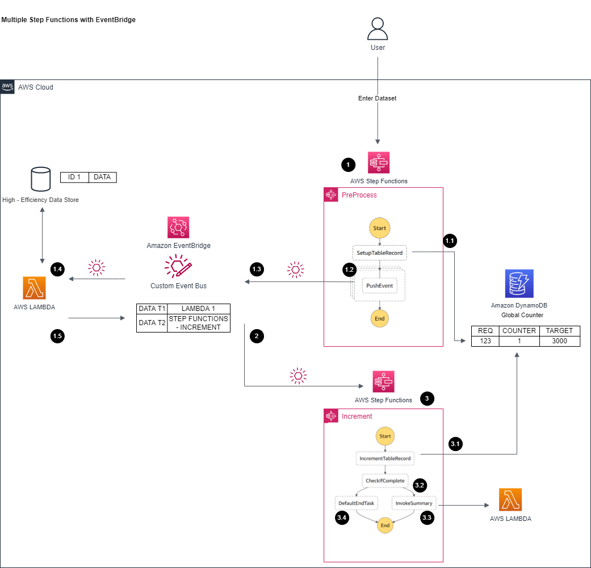

# Multi - Step Function with EventBridge (No Callback Pattern)

[[_TOC_]]

## Customer Requirements
Please found in parent [README](../README.md)

## Assumptions
Please found in parent [README](../README.md)

## Target technology stack  
- Data passed into step functions/computing lambda is only reference id
   - The actual data with reference id is in outside data source
   - Each reference id maps to one record that can be modified independently
   - This allows fast data access and modification while not slow down invocation due to large data inter-traveling
   - Assume large datasets/computing results are saved into another high - efficiency datastore such as AWS ElasticCache (not implement in this code sample)
<br>

- Data will need to be updated with a length field if not already included, as Step Function currently not able to count length of an array out of box
   - A flat array within `requests` field and a `length` field to indicate array's size 
```
{"requestId":"123456","requests":[{"caseId":"0"},{"caseId":"1"},{"caseId":"2"},{"caseId":"3"},{"caseId":"4"},{"caseId":"5"},{"caseId":"6"},{"caseId":"7"},{"caseId":"8"},{"caseId":"9"},{"caseId":"10"},{"caseId":"11"},{"caseId":"12"},{"caseId":"13"},{"caseId":"14"},{"caseId":"15"},{"caseId":"16"},{"caseId":"17"},{"caseId":"18"},{"caseId":"19"},{"caseId":"20"},{"caseId":"21"},{"caseId":"22"},{"caseId":"23"},{"caseId":"24"},{"caseId":"25"},{"caseId":"26"},{"caseId":"27"},{"caseId":"28"},{"caseId":"29"},{"caseId":"30"},{"caseId":"31"},{"caseId":"32"},{"caseId":"33"},{"caseId":"34"},{"caseId":"35"},{"caseId":"36"},{"caseId":"37"},{"caseId":"38"},{"caseId":"39"},{"caseId":"40"},{"caseId":"41"},{"caseId":"42"},{"caseId":"43"},{"caseId":"44"},{"caseId":"45"},{"caseId":"46"},{"caseId":"47"},{"caseId":"48"},{"caseId":"49"},{"caseId":"50"},{"caseId":"51"},{"caseId":"52"},{"caseId":"53"},{"caseId":"54"},{"caseId":"55"},{"caseId":"56"},{"caseId":"57"},{"caseId":"58"},{"caseId":"59"},{"caseId":"60"},{"caseId":"61"},{"caseId":"62"},{"caseId":"63"},{"caseId":"64"},{"caseId":"65"},{"caseId":"66"},{"caseId":"67"},{"caseId":"68"},{"caseId":"69"},{"caseId":"70"},{"caseId":"71"},{"caseId":"72"},{"caseId":"73"},{"caseId":"74"},{"caseId":"75"},{"caseId":"76"},{"caseId":"77"},{"caseId":"78"},{"caseId":"79"},{"caseId":"80"},{"caseId":"81"},{"caseId":"82"},{"caseId":"83"},{"caseId":"84"},{"caseId":"85"},{"caseId":"86"},{"caseId":"87"},{"caseId":"88"},{"caseId":"89"},{"caseId":"90"},{"caseId":"91"},{"caseId":"92"},{"caseId":"93"},{"caseId":"94"},{"caseId":"95"},{"caseId":"96"},{"caseId":"97"},{"caseId":"98"},{"caseId":"99"}],"length":"100"}
```
<br>

- PreProcess Step Function
   - A step function is created to use as entry point for this whole flow
   - Processes the request and analyzes required computing requests into the Dynamo counter table
   - Map Iterator loops through each computing within the request
   - Push each required computation request into EventBridge
   - Complete the step function
   - The reason used Step Function is to audit the overall process and managed DyanmoDB/EventBridge integrations (no need to update backend libraries) with audit built - in (step function execution logs)
<br>

- Counter DynamoDB Table
   - A dynamo DB table is created as a global counter to track number of computing requests within each request as a way to determine next step can be triggered

| requestId (the target request id)	| counter (already processed computing within this request)	| target |
| --- | --- | --- |
| 123	| 0	| 1000 |

- 
   - Right now, there is no deletion of records. Customer will need to clean up either as part of step function or part of their data retiring process
   - One row per request, when a computing is done, the request's counter column will be incremented by 1

<br>
 
- Computing EventBridge
   - Routing events between step functions and computing services
   - A dedicated EventBridge is setup with following routing rules:

| Event Pattern | Invocation Target for Matching Events | Transformation |	Description |
| --- | --- | --- | --- |
|{<br> "source":  "com.computing.lambda"<br>} 	| Computing Lambda |	None <br><br> This result an EventBridge wrapper around the inputted data, target Lambda will need to extract it |	Event from PreProcess Step Function, will route to Computing Lamda to be processed |
|{<br> "source": "com.preprocess.stepfunction"<br>} 	| Increment Step Function | $.detail <br><br> Will only send the detail portion (the original inputted data) and eliminate the wrapper. This is to demo transformation. If step function need the data field (trigger time etc), then can remove transformation, and process in target Step Function	| Events from Computing Lambda to notify computing is completed, will be pushed to Increment Step Function for updating and proceed to next step if ready | 

- 
   - This event bridge allows (1) the computing request to forward to computing lambda and (2) the computing complete message to the increment step function
   - It can be extended to add computing targets + data matching as new matching rules. This implementation reduces complexity within step function from managing different computing services with different functions to focus on main workflow logic only.
   - EventBridge's build - in retry logics + integration with computing services also simplify code deployment/management.

<br>

- Computing Lambda
   - The main execution logic with the info in passed in event (request ID + case ID)
   - Assume the execution time is same no matter how many concurrency
   - Assume large datasets/computing results are saved into another high - efficiency datastore such as AWS ElasticCache (not implement in this code sample)
   - In this code sample, system sleep is used to simulate execution
   - Once computation is complete, will then send an event back to EventBridge through AWS SDK (Python) with limited info (request ID, case ID) to notify the workflow this computing is completed (as assume bulk of results are in high - efficient datastore)
<br>

- Increment Step Function
   - Receive complete event from Computing lambda (through EventBridge)
   - Use build-in DynamoDB step to increase counter value by 1 in target request row
   - Check if counter value matches to target
   - If matches, this indicates all computing completes in target request. This triggers next step (Summary Lambda) and mark the workflow as complete
   - If not matches, then just mark the workflow as complete
<br>

- Summary Lambda
   - A place holder for next step, for this code sample, basically just pass in the processed time of each computing Lambda + request ID
   - In real world use case, also will leverage the result data in high efficiency datastore (not implemented in this demo)
<br>

- AWS X-Ray
   - The AWS X-Ray is enabled within system to capture end to end flow. However, there is limitation due to service quota, detail can be found in `Additional-Notes` section
<br>


## Target Architecture  



### Walkthrough
This design leverages step function for main business flow: 
1. Split input into concurrency executions
   1. Setup counter target (base on input items)
   2. Step Function push data as event (no callback, just fire) into EventBridge
   3. Eventbridge base on event matching (inside data field with defined policy in the target bus) invoke corresponding Lambda
   4. Lambda processes input data
   5. Lambda push event to event stream with different event fields to signal complete
2. Eventbridge routes the event to different step function for counter based on matching pattern
3. EventBridge triggers another step function to handle counter logic
   1. Incremental counter to indicate there is one item completion
   2. Check if this is the last item to proceed to next step by checking counter and target
   3. If matching counter target, trigger next step (as all items complete)
4. If not reach counter target, just end step function


## Advantage
- Utilize Step Function to get out of box monitor/retry logic/state machines
- Utilize EventBridge to route to correct Lambda/Step Functions/other destinations* base on event fields instead of maintain complex data routing logic in step functions/lambdas
- Able to push higher concurrency vs other attempts


## Disadvantages
- Complex compare (such as counter with lock) to other approaches due to its distributed nature
- Need to monitor limit around resources due to the system may able to trigger computations behind limits
- Have overhead for short lambda executions (few seconds overhead)


## Automation and scale
The deployment of this architecture if fully automated by CDK.

This approaches will scale concurrency computing up to AWS account limit (i.e. limit of Lambda concurrency and DynamoDB throughput limit) so will recommend to increase limit in advance if expects large payload

This approach solves [Challenge #1 Performance when the workflow involved high concurrency computing](../README.md) and [Challenge #3 The overhead of adding another services](../README.md) in customer challenges as it outperforms other approaches especially in higher concurrency (please see Pattern Performance Comparison section in parent section)

This approach allows operation scalability and solves [Challenge #2 Explore and integrate different computation targets as needed](../README.md) with keep data with target computing service relationship to event bridge (explain more in above architecture)

Regarding some changes need for production setup, please reference `Additional Notes` section


## Additional Notes
The code in code sample is acting as a high-level implementation, following should be addressed within actual implementation for production setup:

1. DynamoDB records are not being clean up after execution. It can be addressed as a later step within the incremental Step Function after the step is completed or as part of custom data retiring policy. 

2. The AWS X-Ray is enabled within system to capture end to end flow. However, due to [AWS X-Ray quota limit](https://docs.aws.amazon.com/general/latest/gr/xray.html), if concurrency number (i.e 500 concurrency calculation in one request) is behind certain limit, the X-Ray trace capture will be throttled due to quota limit. The execution will not be impacted, but the trace will be incomplete.

3. Execution logs/metrics (in CloudWatch/CloudWatch Logs/XRay) from Step Functions/Lambda are not being clean up. It can be addressed with CloudWatch logs configuration, X-Ray configuration, and/or Step Function configuration or as part of custom data retiring policy. 

Most customer preferred custom data retiring policy to protect against these logs/data for future auditing/debugging, so this codebase does not address and focus only on the pattern portion.

4. Dead Letter Queue (DLQ) and retry logics are not implemented in every layer. In some cases, customers may want more retry in certain step function step before erroring out the workflow, so will need to fine - tune these setups.

5. In some cases, the stack may include additional setup (such as enabling log group for step functions) that customer may wish to perform otherwise, so please evaluate carefully before taking the code into production. The setup includes [cdk-nag](https://github.com/cdklabs/cdk-nag) by default to ensure stack follows certain known best practices.


## Sample Dataset
Sample dataset for the performance test can be found in [sample_data_sets](sample_data_sets) folder

Can regenerate again through (assume [Node.js](https://nodejs.org/en/) later than 10.x installed)
```
node generate.js
```

(Optional) Same function is also implemented in Go, can generate again through (assume [Go](https://go.dev/) 1.17 or later installed)
```
go run generate.go
```

## Deploy / Clean up
Deploy this stack to your default AWS account/region (assume [AWS CDK](https://aws.amazon.com/cdk/) 2.1.0 or later installed)

In the current folder

Install dependency for cdk stack
```
npm install
```

Install dependency for lambda
```
cd lambda_fns
// Install dependency for lambda functions
npm install
```

Deploy the stack
```
cdk deploy
```

Clean up the deployed account   
```
cdk destroy
```     
