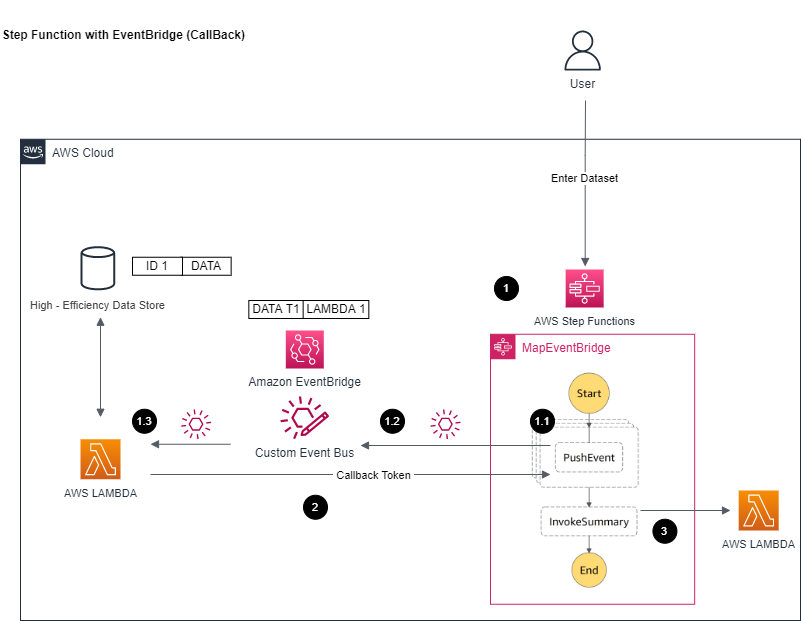

# Map Iterator with Event Bridge (CallBack)

[[_TOC_]]

## Customer Requirements
Please found in parent [README](../README.md)

## Assumptions
Please found in parent [README](../README.md)

## Target Architecture


### Walkthrough
1. Performs concurrent invocations over an array input
1.1. Each invocation take an item within array and push as event (+ a callback token) into event bridge and wait for callback event
1.2. EventBridge base on pattern match route event to correct Lambda
1.3. Lambda will process incoming event, and use token within event to notify Step Function to complete the step
2. Step function will wait until all invocations are completed (all callback tokens are received) and then proceed next step
3. Invoke next step as all invocations are completed

## Technology Components  
- Data passed into step functions/computing lambda is only reference id
    - Same as [Option #1 Multi - Step Function with EventBridge (No Callback Pattern)](../multi-step-functions-eventbridge)
<br>

- Data will need to be an array
    - Same as [Option #2 Step Function Map Iterator](../step-function-map-iterator)
<br>

Process Step Function
A step function is created to use as entry point for this whole flow
Map Iterator loops through each computing within the request
For each computing request, generates a callback token, pushes the token + request payload to EventBridge
Step function will wait until a callback is triggered with callback token and loop through next data until all data are completed
The difference between this design and #1 is step function's callback mechanism handle the counter/audit of completion of all computing requests. This removes the management of a global counter and logic to proceed to next step
<br>

- Computing EventBridge
    - Routing events between step functions and computing services
    - A dedicated EventBridge is setup with following routing rules:

| Event Pattern	| Invocation Target for Matching Events | Transformation | Description |
| --- | --- | --- | --- |
|{<br> "source" : "com.computing.lambda"<br>}	| Computing Lambda |	None <br><br> This result an EventBridge wrapper around the inputted data, target Lambda will need to extract it	Event from PreProcess Step Function, will route to Computing Lambda to be processed | This event bridge allows the computing request to forward to computing lambda. |

- 
    - It can be extended to add computing targets + data matching as new matching rules. This implementation reduces complexity within step function from managing different computing services with different functions to focus on main workflow logic only.
    - EventBridge build - in retry logics + integration with computing services also simplify code deployment/management.
<br>

- Computing Lambda
    - The main execution logic with the info in passed in event (request ID + case ID)
    - Assume the execution time is same no matter how many concurrency 
    - Assume large datasets/computing results are saved into another high - efficiency datastore such as AWS ElasticCache (not implement in this code sample)
    - In this code sample, system sleep is used to simulate execution
    - Once computation is complete, return a message with limited info (request ID, case ID) to notify the workflow this computing is completed (as assume bulk of results are in high - efficient datastore)
<br>

- Summary Lambda
    - Same as [Option #1 Multi - Step Function with EventBridge (No Callback)](../multi-step-functions-eventbridge)
<br>

- AWS X-Ray
    - Same as [Option #1 Multi - Step Function with EventBridge (No Callback)](../multi-step-functions-eventbridge)
<br>


## Advantages
- This will be the recommend approach if want to leverage Step Functions + Event Bridge but do not want to manage the global counter
- Performances is similar to options [Option #2 Step Function Map Iterator](../step-function-map-iterator)


## Disadvantages
- Limited by Map Iterator's 40 concurrency limit as in #2, but now with EventBridge and callback overhead, slightly slow than [Option #2 Step Function Map Iterator](../step-function-map-iterator). If performance matters but want EventBridge integration, [Option #1 Multi - Step Function with EventBridge (No Callback Pattern)](../multi-step-functions-eventbridge) is more ideal


## Automation and scale
The deployment of this architecture if fully automated by CDK.

This approach will scale concurrency computing up to AWS account limit (i.e. limit of Lambda concurrency and DynamoDB throughput limit) so will recommend to increase limit in advance if expects large payload

This approach is simpler compare to [Option #1 Multi - Step Function with EventBridge (No Callback Pattern)](../multi-step-functions-eventbridge) but come with disadvantage of being slower than that approach. The simple portion makes it easier to monitor as only has one step function and no global lock need to manage.

This approach solves [Challenge #2 Explore and integrate different computation targets as needed](../README.md) with keep data with target computing service relationship to event bridge (explain more in above architecture)

Regarding some changes need for production setup, please reference `Additional Notes` section


## Additional Notes
The code in code sample is acting as a high-level implementation, following should be addressed within actual implementation for production setup:

1. The AWS X-Ray is enabled within system to capture end to end flow. However, due to [AWS X-Ray quota limit](https://docs.aws.amazon.com/general/latest/gr/xray.html), if concurrency number (i.e 500 concurrency calculation in one request) is behind certain limit, the X-Ray trace capture will be throttled due to quota limit. The execution will not be impacted, but the trace will be incomplete.

2. Execution logs from Step Functions/Lambda are not being clean up. It can be addressed with CloudWatch logs configuration and/or Step Function configuration or as part of custom data retiring policy. 

Most customer preferred custom data retiring policy to protect against these logs/data for future auditing/debugging, so this codebase does not address and focus only on the pattern portion.

3. Dead Letter Queue (DLQ) and retry logics are not implemented in every layer. In some cases, customers may want more retry in certain step function step before erroring out the workflow, so will need to fine - tune these setups.

4. In some cases, the stack may include additional setup (such as enabling log group for step functions) that customer may wish to perform otherwise, so please evaluate carefully before taking the code into production. The setup includes [cdk-nag](https://github.com/cdklabs/cdk-nag) by default to ensure stack follows certain known best practices. 


## Sample Dataset
Sample dataset for the performance test can be found in [sample_data_sets](sample_data_sets) folder

Can regenerate again through (assume [Node.js](https://nodejs.org/en/) later than 10.x installed)
```
node generate.js
```

(Optional) Same function is also implemented in Go, can generate again through (assume [Go](https://go.dev/) 1.17 or later installed)
```
go run generate.go
```


## Deploy / Clean up
Deploy this stack to your default AWS account/region (assume [AWS CDK](https://aws.amazon.com/cdk/) 2.1.0 or later installed)

In the current folder

Install dependency for cdk stack
```
npm install
```

Install dependency for lambda
```
cd lambda_fns
// Install dependency for lambda functions
npm install
```

Deploy the stack
```
cdk deploy
```

Clean up the deployed account   
```
cdk destroy
```     
