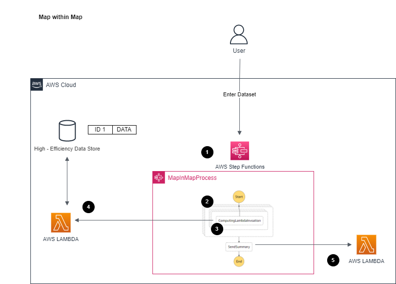

# Map Iterator within Map Iterator

[[_TOC_]]

## Customer Requirement
Please found in parent [README](../README.md)


## Assumptions
Please found in parent [README](../README.md)


## Target Technology Stack  
- Data passed into step functions/computing lambda is only reference id
    - Same as [Option #1 Multi - Step Function with EventBridge (No Callback Pattern)](../multi-step-functions-eventbridge)
- This design is similar to [Option #2 Step Function Map Iterator](../step-function-map-iterator) except over how Step Function interact with invocation of computing Lambda
    - This design attempts to overcome the Map Iterator 40 concurrency limit through a map iterator within map iterator. In theory, this will allow each of 40 outer map iterator processes trigger 40 internal map iterator processes, which result 40 x 40 => 1600 processes concurrently at once.
- Data need to be formatted into specific way: nested array
    - An outer array `requestSlots` that contains multiple inner `requests` arrays
    - Data will need to be partitioned so each inner `requests` array will have maximum of 40 objects (as the Step Function map iterator limit is at 40) and then create new inner `requests` array to hold next items until all items are being added in
```
{"requestId":"123456","requestSlots":[{"requests":[{"caseId":"0"},{"caseId":"1"},{"caseId":"2"},{"caseId":"3"},{"caseId":"4"},{"caseId":"5"},{"caseId":"6"},{"caseId":"7"},{"caseId":"8"},{"caseId":"9"},{"caseId":"10"},{"caseId":"11"},{"caseId":"12"},{"caseId":"13"},{"caseId":"14"},{"caseId":"15"},{"caseId":"16"},{"caseId":"17"},{"caseId":"18"},{"caseId":"19"},{"caseId":"20"},{"caseId":"21"},{"caseId":"22"},{"caseId":"23"},{"caseId":"24"},{"caseId":"25"},{"caseId":"26"},{"caseId":"27"},{"caseId":"28"},{"caseId":"29"},{"caseId":"30"},{"caseId":"31"},{"caseId":"32"},{"caseId":"33"},{"caseId":"34"},{"caseId":"35"},{"caseId":"36"},{"caseId":"37"},{"caseId":"38"},{"caseId":"39"}]},{"requests":[{"caseId":"40"},{"caseId":"41"},{"caseId":"42"},{"caseId":"43"},{"caseId":"44"},{"caseId":"45"},{"caseId":"46"},{"caseId":"47"},{"caseId":"48"},{"caseId":"49"},{"caseId":"50"},{"caseId":"51"},{"caseId":"52"},{"caseId":"53"},{"caseId":"54"},{"caseId":"55"},{"caseId":"56"},{"caseId":"57"},{"caseId":"58"},{"caseId":"59"},{"caseId":"60"},{"caseId":"61"},{"caseId":"62"},{"caseId":"63"},{"caseId":"64"},{"caseId":"65"},{"caseId":"66"},{"caseId":"67"},{"caseId":"68"},{"caseId":"69"},{"caseId":"70"},{"caseId":"71"},{"caseId":"72"},{"caseId":"73"},{"caseId":"74"},{"caseId":"75"},{"caseId":"76"},{"caseId":"77"},{"caseId":"78"},{"caseId":"79"}]},{"requests":[{"caseId":"80"},{"caseId":"81"},{"caseId":"82"},{"caseId":"83"},{"caseId":"84"},{"caseId":"85"},{"caseId":"86"},{"caseId":"87"},{"caseId":"88"},{"caseId":"89"},{"caseId":"90"},{"caseId":"91"},{"caseId":"92"},{"caseId":"93"},{"caseId":"94"},{"caseId":"95"},{"caseId":"96"},{"caseId":"97"},{"caseId":"98"},{"caseId":"99"}]}]}
```

- This in theory will force the map iterator to invoke 100 or closer concurrency lambda
However, during testing, it is proved the overall result is much worse:
    - Invocation of Map Iterator are indeed closer to 100 concurrency invocations, but the time to actual Lambda invocation is much slower
    - This behavior results unstable performance in Lambda usage and result much worse end result
<br>

- Computing Lambda
    - Same as [Option #2 Step Function Map Iterator](../step-function-map-iterator)
<br>

- Summary Lambda
    - Same as [Option #2 Step Function Map Iterator](../step-function-map-iterator)
<br>

- AWS X-Ray
    - Same as [Option #1 Multi - Step Function with EventBridge (No Callback)](../multi-step-functions-eventbridge)
<br>


## Target Architecture



## Walkthrough
1. Processes the request
2. Outer Map Iterator maps through the outer of the nested array
3. Inter Map Iterator processes through the given inter array
For each request, pushes to Lambda to processes the input event 
4. Lambda processes the input event and returns completed message  
5. Triger next step with summary info to Summary Lambda


## Advantages
- In theory, achieves more concurrency at Lambda (but please note about disadvantages)


## Disadvantages
- Performance is worse than default one layer of Map Iterator ([Option #2 Step Function Map Iterator](../step-function-map-iterator), which is not even the fastest option)
- The Step Function is much more complex to manage and performance is not consistent (sometime better, sometime worse. But even better time is still slow than [Option #2 Step Function Map Iterator](../step-function-map-iterator)). The wait and invocation period seem to be inconsistent between run even with same dataset and setup.
- The data need to be formatted into specific format (nested array) makes the overall process much more complex to debug
- This is the worst performances out of all approaches, and that difference is higher with more items to be processed


## Automation and scale
- The deployment of this architecture if fully automated by CDK.
- This will have performance scalability issue in larger concurrency and is not recommended as there is no direct benefit


## Additional Notes
The code in code sample is acting as a high-level implementation, following should be addressed within actual implementation for production setup:

1. The AWS X-Ray is enabled within system to capture end to end flow. However, due to [AWS X-Ray quota limit](https://docs.aws.amazon.com/general/latest/gr/xray.html), if concurrency number (i.e. 500 concurrency calculation in one request) is behind certain limit, the X-Ray trace capture will be throttled due to quota limit. The execution will not be impacted, but the trace will be incomplete.

2. Execution logs from Step Functions/Lambda are not being clean up. It can be addressed with CloudWatch logs configuration and/or Step Function configuration or as part of custom data retiring policy. 

Most customer preferred custom data retiring policy to protect against these logs/data for future auditing/debugging, so this codebase does not address and focus only on the pattern portion.

3. In some cases, the stack may include additional setup (such as enabling log group for step functions) that customer may wish to perform otherwise, so please evaluate carefully before taking the code into production. The setup includes [cdk-nag](https://github.com/cdklabs/cdk-nag) by default to ensure stack follows certain known best practices.


## Sample Dataset
Sample dataset for the performance test can be found in [sample_data_sets](sample_data_sets) folder

Can regenerate again through (assume [Node.js](https://nodejs.org/en/) later than 10.x installed)
```
node nested_generate.js
```

(Optional) Same function is also implemented in Go, can generate again through (assume [Go](https://go.dev/) 1.17 or later installed)
```
go run nested_generate.go
```


## Deploy / Clean up
Deploy this stack to your default AWS account/region (assume [AWS CDK](https://aws.amazon.com/cdk/) 2.1.0 or later installed)

In the current folder

Install dependency for cdk stack
```
npm install
```

Install dependency for lambda
```
cd lambda_fns
// Install dependency for lambda functions
npm install
```

Deploy the stack
```
cdk deploy
```

Clean up the deployed account   
```
cdk destroy
```     
