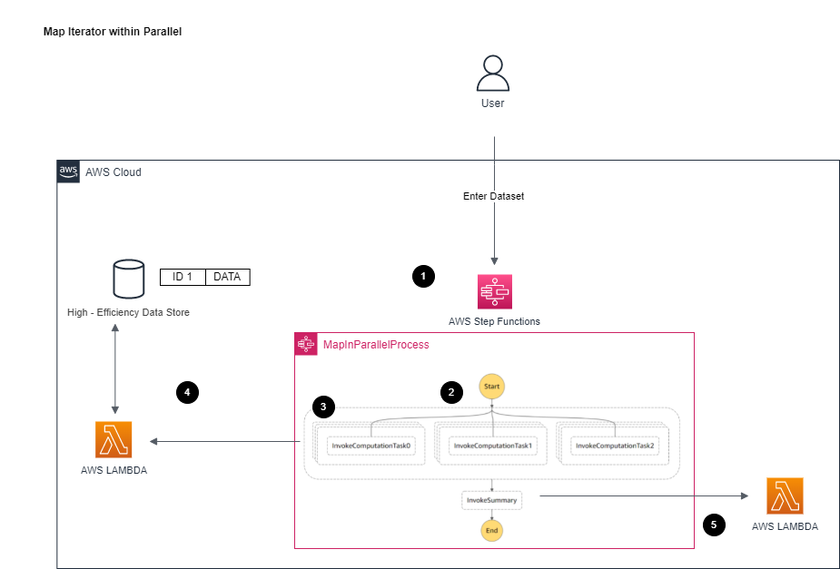

# Map Iterator within Parallel

[[_TOC_]]

## Customer Requirement
Please found in parent [README](../README.md)


## Assumptions
Please found in parent [README](../README.md)


## Target technology stack  
- Data passed into step functions/computing lambda is only reference id
    - Same as [Option #1 Multi - Step Function with EventBridge (No Callback Pattern)](../multi-step-functions-eventbridge)
<br>

- This design is similar to [Option #2 Step Function Map Iterator](../step-function-map-iterator) except over how Step Function interact with invocation of computing Lambda
    - This design attempts to overcome the Map Iterator 40 concurrency limit through a map iterator within parallel. In theory, parallel step will trigger each of three map iterators at same time, which result 3 x 40 => 120 processes concurrently at once.
<br>

- Data need to be formatted into specific way: nested array with fixed number of inner arrays
    - An outer array `requestSlots` that contains fixed inner `requests` arrays (number of inner arrays equals to number of slots in parallel step, in this case is three)
    - Data will need to be split into each inner `requests` array
```
{"requestId":"123456","requestSlots":[{"requests":[{"caseId":"0"},{"caseId":"1"},{"caseId":"2"},{"caseId":"9"},{"caseId":"10"},{"caseId":"11"},{"caseId":"18"},{"caseId":"19"},{"caseId":"20"},{"caseId":"27"},{"caseId":"28"},{"caseId":"29"},{"caseId":"36"},{"caseId":"37"},{"caseId":"38"},{"caseId":"45"},{"caseId":"46"},{"caseId":"47"},{"caseId":"54"},{"caseId":"55"},{"caseId":"56"},{"caseId":"63"},{"caseId":"64"},{"caseId":"65"},{"caseId":"72"},{"caseId":"73"},{"caseId":"74"},{"caseId":"81"},{"caseId":"82"},{"caseId":"83"},{"caseId":"90"},{"caseId":"91"},{"caseId":"92"},{"caseId":"99"}]},{"requests":[{"caseId":"3"},{"caseId":"4"},{"caseId":"5"},{"caseId":"12"},{"caseId":"13"},{"caseId":"14"},{"caseId":"21"},{"caseId":"22"},{"caseId":"23"},{"caseId":"30"},{"caseId":"31"},{"caseId":"32"},{"caseId":"39"},{"caseId":"40"},{"caseId":"41"},{"caseId":"48"},{"caseId":"49"},{"caseId":"50"},{"caseId":"57"},{"caseId":"58"},{"caseId":"59"},{"caseId":"66"},{"caseId":"67"},{"caseId":"68"},{"caseId":"75"},{"caseId":"76"},{"caseId":"77"},{"caseId":"84"},{"caseId":"85"},{"caseId":"86"},{"caseId":"93"},{"caseId":"94"},{"caseId":"95"}]},{"requests":[{"caseId":"6"},{"caseId":"7"},{"caseId":"8"},{"caseId":"15"},{"caseId":"16"},{"caseId":"17"},{"caseId":"24"},{"caseId":"25"},{"caseId":"26"},{"caseId":"33"},{"caseId":"34"},{"caseId":"35"},{"caseId":"42"},{"caseId":"43"},{"caseId":"44"},{"caseId":"51"},{"caseId":"52"},{"caseId":"53"},{"caseId":"60"},{"caseId":"61"},{"caseId":"62"},{"caseId":"69"},{"caseId":"70"},{"caseId":"71"},{"caseId":"78"},{"caseId":"79"},{"caseId":"80"},{"caseId":"87"},{"caseId":"88"},{"caseId":"89"},{"caseId":"96"},{"caseId":"97"},{"caseId":"98"}]}]}
```
<br>

- This in theory will force the map iterator to invoke 100 or closer concurrency lambda
- However, during testing, it is proved the overall result is much worse:
    - Invocation of Map Iterator are indeed closer to 100 concurrency invocations, but the time to actual Lambda invocation is much slower
    - This behavior results unstable performance in Lambda usage and result much worse end result
<br>

Other areas are similar to [Option #3 Map Iterator within Map Iterator](step-function-map-in-map)


## Target Architecture


### Walkthrough
1. Processes the request 
2. The outer parallel pass down each of `requestSlots[0]` to to parallel step's `slot 0` step, `requestSlots[1]` to to parallel step's `slot 1` step, and `requestSlots[2]` to parallel step's `slot 2` step
3. Each map iterates through the items within its assigned array and invoke lambda with it.
4. Step function will wait until all invocations are completed (all callback tokens are received) and then proceed next step
5. Invoke next step as all invocations are completed

## Advantages
Same as [Option #3 Map Iterator within Map Iterator](step-function-map-in-map)


## Disadvantages
Same as [Option #3 Map Iterator within Map Iterator](step-function-map-in-map) except this design performs better than it (second to worst)


## Automation and scale
Same as [Option #3 Map Iterator within Map Iterator](step-function-map-in-map)


## Additional Notes
Same as [Option #3 Map Iterator within Map Iterator](step-function-map-in-map)


## Sample Dataset
Sample dataset for the performance test can be found in [sample_data_sets](sample_data_sets) folder

Can regenerate again through (assume [Node.js](https://nodejs.org/en/) later than 10.x installed)
```
node parallel_generate.js
```

(Optional) Same function is also implemented in Go, can generate again through (assume [Go](https://go.dev/) 1.17 or later installed)
```
go run parallel_generate.go
```


## Deploy / Clean up
Deploy this stack to your default AWS account/region (assume [AWS CDK](https://aws.amazon.com/cdk/) 2.1.0 or later installed)

In the current folder

Install dependency for cdk stack
```
npm install
```

Install dependency for lambda
```
cd lambda_fns
// Install dependency for lambda functions
npm install
```

Clean up the deployed account   
```
cdk destroy
```     
