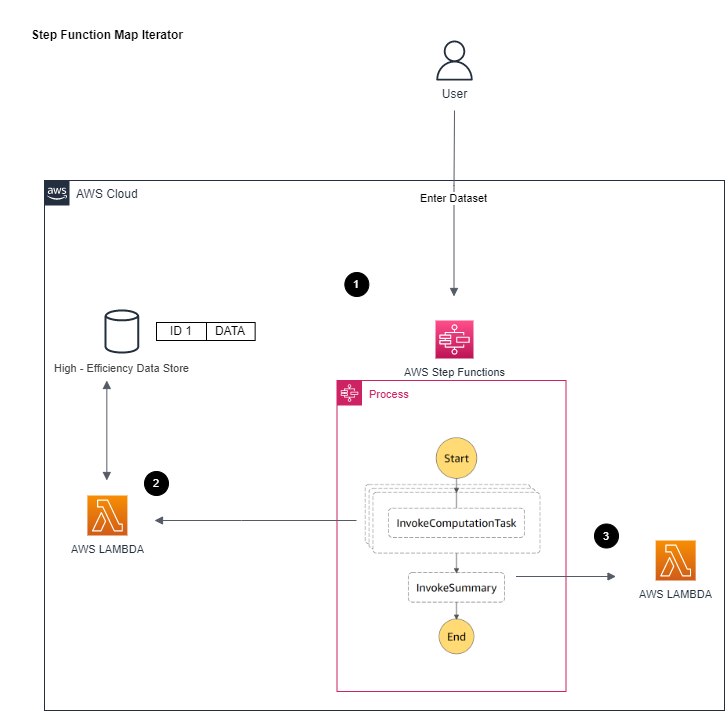

# Step Function Map Iterator

[[_TOC_]]

## Customer Requirement
Please found in parent [README](../README.md)

## Assumptions
Please found in parent [README](../README.md)

## Target Architecture


### Walkthrough
1. Processes the request 
Uses Map Iterator step to loop through each computing request
For each computing request, pushes through Lambda and wait for its completion
Complete the step function
2. Lambda processes the input event and returns completed message  
3. Triger next step with summary info to Summary Lambda

## Technology Components  
- Data passed into step functions/computing lambda is only reference id
    - Same as [Option #1 Multi - Step Function with EventBridge (No Callback Pattern)](../multi-step-functions-eventbridge)
<br>

- Data will need to be an array
    - A flat array within `requests` field and an optional `length` field to indicate array length
```
{"requestId":"123456","requests":[{"caseId":"0"},{"caseId":"1"},{"caseId":"2"},{"caseId":"3"},{"caseId":"4"},{"caseId":"5"},{"caseId":"6"},{"caseId":"7"},{"caseId":"8"},{"caseId":"9"},{"caseId":"10"},{"caseId":"11"},{"caseId":"12"},{"caseId":"13"},{"caseId":"14"},{"caseId":"15"},{"caseId":"16"},{"caseId":"17"},{"caseId":"18"},{"caseId":"19"},{"caseId":"20"},{"caseId":"21"},{"caseId":"22"},{"caseId":"23"},{"caseId":"24"},{"caseId":"25"},{"caseId":"26"},{"caseId":"27"},{"caseId":"28"},{"caseId":"29"},{"caseId":"30"},{"caseId":"31"},{"caseId":"32"},{"caseId":"33"},{"caseId":"34"},{"caseId":"35"},{"caseId":"36"},{"caseId":"37"},{"caseId":"38"},{"caseId":"39"},{"caseId":"40"},{"caseId":"41"},{"caseId":"42"},{"caseId":"43"},{"caseId":"44"},{"caseId":"45"},{"caseId":"46"},{"caseId":"47"},{"caseId":"48"},{"caseId":"49"},{"caseId":"50"},{"caseId":"51"},{"caseId":"52"},{"caseId":"53"},{"caseId":"54"},{"caseId":"55"},{"caseId":"56"},{"caseId":"57"},{"caseId":"58"},{"caseId":"59"},{"caseId":"60"},{"caseId":"61"},{"caseId":"62"},{"caseId":"63"},{"caseId":"64"},{"caseId":"65"},{"caseId":"66"},{"caseId":"67"},{"caseId":"68"},{"caseId":"69"},{"caseId":"70"},{"caseId":"71"},{"caseId":"72"},{"caseId":"73"},{"caseId":"74"},{"caseId":"75"},{"caseId":"76"},{"caseId":"77"},{"caseId":"78"},{"caseId":"79"},{"caseId":"80"},{"caseId":"81"},{"caseId":"82"},{"caseId":"83"},{"caseId":"84"},{"caseId":"85"},{"caseId":"86"},{"caseId":"87"},{"caseId":"88"},{"caseId":"89"},{"caseId":"90"},{"caseId":"91"},{"caseId":"92"},{"caseId":"93"},{"caseId":"94"},{"caseId":"95"},{"caseId":"96"},{"caseId":"97"},{"caseId":"98"},{"caseId":"99"}],"length":"100"}
```
<br>

- Process Step Function
    - A step function is created to use as entry point for this whole flow
    - Map Iterator loops through each computing within the request
    - For each computing request, pushes through Lambda and wait for completion
    - Complete the step function
    - The reason used Step Function is to audit the overall process and managed DyanmoDB/EventBridge integrations (no need to update backend libraries) with audit built - in (step function execution logs)
<br>

- Computing Lambda
    - The main execution logic with the info in passed in event (request ID + case ID)
    - Assume the execution time is same no matter how many concurrency 
    - Assume large datasets/computing results are saved into another high - efficiency datastore such as AWS ElasticCache (not implement in this code sample)
    - In this code sample, system sleep is used to simulate execution
    - Once computation is complete, return a message with limited info (request ID, case ID) to notify the workflow this computing is completed (as assume bulk of results are in high - efficient datastore)
<br>

- Summary Lambda
    - Same as Option [Option #1 Multi - Step Function with EventBridge (No Callback Pattern)](../multi-step-functions-eventbridge)
<br>

- AWS X-Ray
    - Same as Option [Option #1 Multi - Step Function with EventBridge (No Callback Pattern)](../multi-step-functions-eventbridge)
<br>

## Advantages
- This will be the recommend approach if Step Functions are chosen with its known performance limit
- Able to leverage Step Function's out of box retry/error handling logic
- The simplest form to achieve concurrency with no extra service involved
- Better performances compare to map in map or map in parallel approaches


## Disadvantages
- Limit of 40 concurrencies on the map iterator*. 
- After reaching this limit, the map iterator will execute in batch of 40 concurrent executions until end


## Automation and scale
- The deployment of this architecture if fully automated by CDK.
- This will have performance scalability issue in larger concurrency, but still performs better than [Option #3 Map Iterator within Map Iterator](../step-function-map-in-map) and [Option #4 Map Iterator within Parallel](../step-function-map-in-parallel) 


## Sample Dataset
Sample dataset for the performance test can be found in [sample_data_sets](sample_data_sets) folder

Can regenerate again through (assume [Node.js](https://nodejs.org/en/) later than 10.x installed)
```
node generate.js
```

(Optional) Same function is also implemented in Go, can generate again through (assume [Go](https://go.dev/) 1.17 or later installed)
```
go run generate.go
```


## Deploy / Clean up
Deploy this stack to your default AWS account/region (assume [AWS CDK](https://aws.amazon.com/cdk/) 2.1.0 or later installed)

In the current folder

Install dependency for cdk stack
```
npm install
```

Install dependency for lambda
```
cd lambda_fns
// Install dependency for lambda functions
npm install
```

Deploy the stack
```
cdk deploy
```

Clean up the deployed account   
```
cdk destroy
```     
